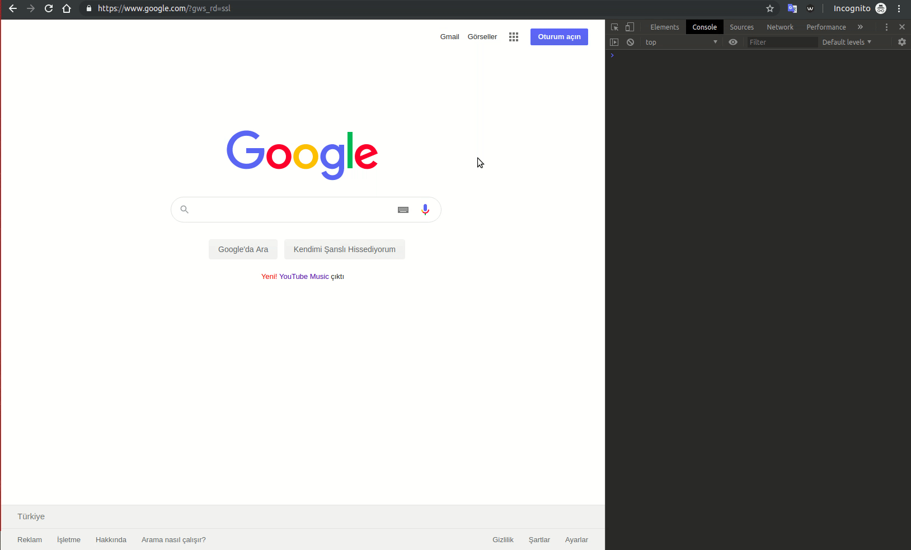

# Setrow Element Seçici

Chrome Extension Sayfası: https://chrome.google.com/webstore/detail/setrow-element-se%C3%A7ici/ifpcmejmjfdflfjdfkkkhnllocpflfog

Setrow "Site Üstü Araç" ürünleri için oluşturulmuş bu eklenti websitelerinde DOM öğelerinin benzersiz Css Selector'unu(querySelector) bulmanızı sağlar.

Eklenti simgesine tıklayarak uzantıyı etkinleştirin, bir öğenin üzerine gelin "Sağ Click" yapın ve içerik menüsünden "Elementi Seç" menüsüne tıklayarak elementin Css Selector'unu kopyalayabilirsiniz. 

Bu eklenti https://github.com/AntonLapshin/getselector adresindeki repodan yararlanılarak oluşturulmuştur.

